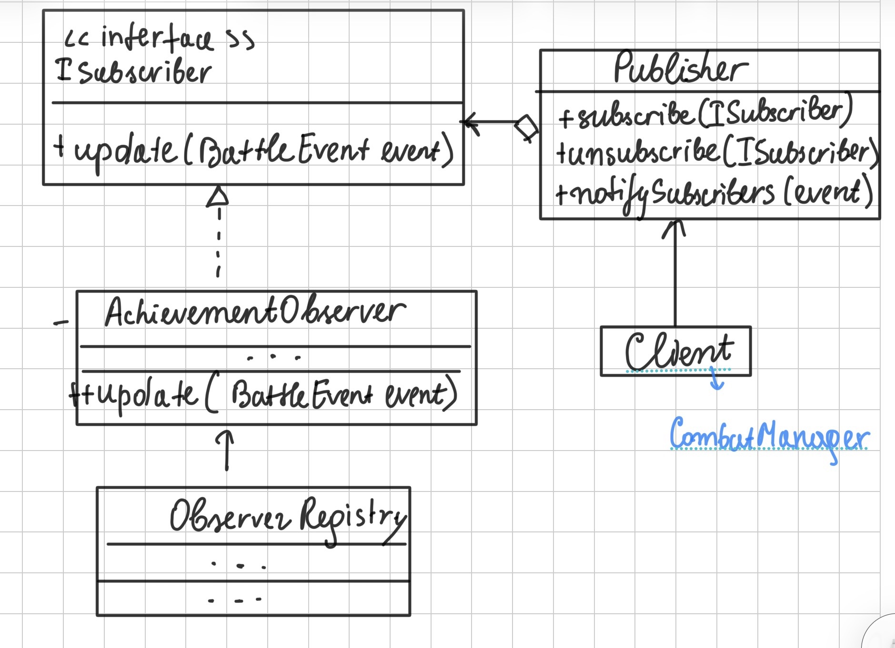
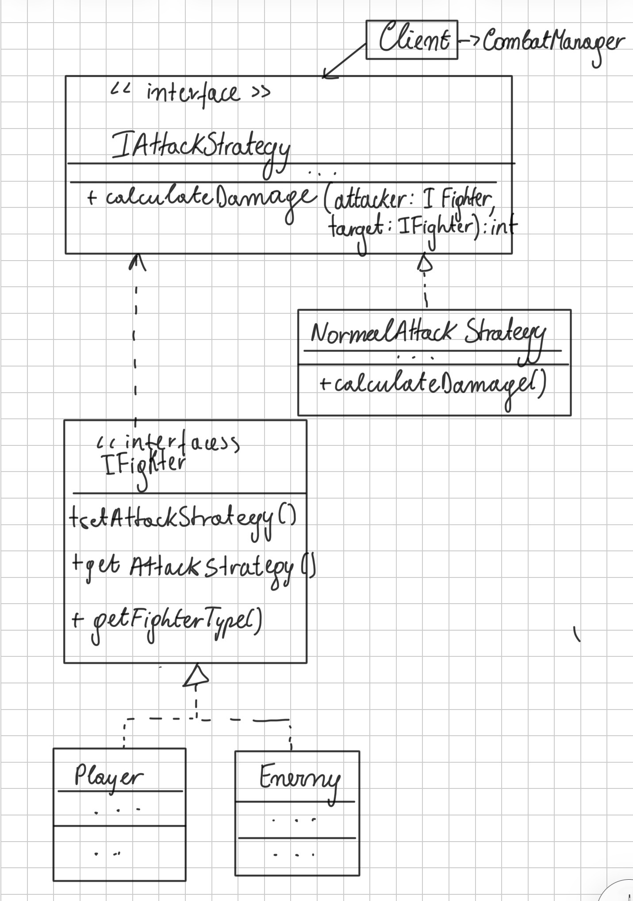
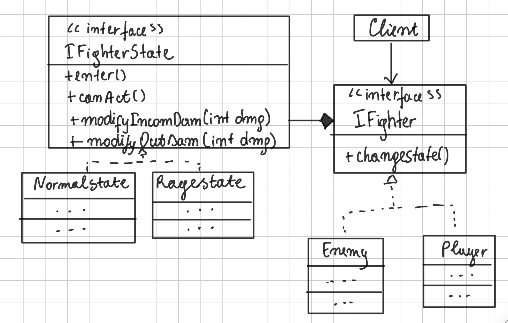

# Laboratory work 3: Behavioral Design patterns
## **Author:** Costin Loredana, FAF-232


## Objectives
1. Study and understand the Behavioral Design Patterns.
2.  As a continuation of the previous laboratory work, think about what communication between software entities might be involed in your system.
3.  Implement some additional functionalities using behavioral design patterns.

## Used Design Patterns:

- Observer
- Strategy
- State

## Implementation:

### 1. Observer

Before behavioural patterns, I have CombatManager with the method battel. Suppose we need to have more methods for the logic of the game, for example achieveent checks. Here, Observers need to decide what to do.
We will need a class BattleEventPublisher, BattleObserver as interface, and the ConcreteObservers. The client in this case will be CombatManager and CombatService.  

CombatManager acts as the publisher, issuing events such as:
- a fighter takes damage;
- a round starts;
- a fighter dies;
- the battle ends;

To support event broadcasting, the publisher maintains a subscription infrastructure.
This infrastructure allows:
1. new subscribers to register;
2. current subscribers to unsubscribe;

The Subscriber interface defines the notification method that all observers must implement.
It typically contains a single method update(), which the publisher calls whenever an event occurs. The update() method may accept several parameters, allowing the publisher to pass important context along with the event.

Subscribers receive a BattleEvent which contains:
type of event:
- attacker
- defender
- damage
- message  

All subscribers implement the same interface, ensuring the publisher remains independent from the concrete observer classes.


#### 1.1. BattleEvent – the event context

BattleEvent is a small data class that carries all information about what happened in combat:

- type – an enum, e.g. DAMAGE, DEATH, ROUND_START, BATTLE_END, BUFF_EXPIRED
- attacker – the IFighter who caused the event (may be null in some events like ROUND_START)
- defender – the IFighter affected by the event
- damage – damage value (for damage events)
- message – a human-readable description (used heavily by loggers)

This object is the context passed to all subscribers when something important happens.

#### 1.2. Subscriber – the Observer interface

```java
public interface Subscriber {
    void update(BattleEvent event);
}
```

- It defines a single update(BattleEvent event) method.
- All observers depend only on BattleEvent, not on CombatManager or other concrete classes.
- This keeps them loosely coupled and supports Dependency Inversion (DIP).
- Any class that wants to react to combat events implements Subscriber.

#### 1.3. Publisher – the Subject / Observable

```java
public class Publisher {

    private final List<Subscriber> subscribers = new ArrayList<>();

    public void subscribe(Subscriber s) { ... }
    public void unsubscribe(Subscriber s) { ... }
    public void notifySubscribers(BattleEvent event) { ... }
}
```

Responsibility:

- It keeps the list of subscribers.
- Provides methods to register and unregister subscribers.
- When ```notifySubscribers``` is called, it forwards the BattleEvent to all current subscribers by calling ```update(event)``` on each.

```Important point```:

Publisher knows only the Subscriber interface, not concrete classes like ConsoleBattleLogger or AchievementObserver.

#### 1.4. CombatManager – Concrete Subject using Publisher

CombatManager is the concrete source of events. It encapsulates battle rules and owns one Publisher instance:

```java
private final Publisher publisher = new Publisher();
public Publisher getPublisher() { return publisher; }
```

- When the battle starts, it sends a  ```ROUND_START``` event.
- Every time one fighter damages another, it sends a ```DAMAGE``` event.
- When a fighter dies, it sends a ```DEATH``` event.
- When the loop ends, it sends a ```BATTLE_END``` event.

Example:

```java
publisher.notifySubscribers(
    new BattleEvent(
        BattleEvent.Type.DAMAGE,
        player,
        enemy,
        damageToEnemy,
        player.getName() + " hits " + enemy.getName() +
        " for " + damageToEnemy + " damage."
    )
);
```

Therefore, CombatManager:
- Holds the combat business logic
- Delegates notification responsibility to Publisher
- Does not know who listens, how many observers there are, or what they do

That is exactly the Observer intent: “one-to-many dependency between objects so that when one object changes state, all its dependents are notified and updated automatically.”

#### 1.5. Concrete Subscribers

1. ConsoleBattleLoger:
    - Prints the event.message to the console.
    - Reacts to events like ```ROUND_START```, ```DAMAGE```, ```DEATH```, ```BATTLE_END```.
    - Responsible for presenting the battle flow.

2. StatisticsObserver:
    - Keeps an internal counter totalDamage.
    - On ```DAMAGE``` events, accumulates ```event.damage``` and prints: ```[STATS] Total damage so far: X```
    - Responsible for tracking numeric metrics independent of the combat logic.

3. AchievementObserver:
    - Unlocks logical ```achievements``` based on events:
    - First ```DAMAGE``` event -> “First Blood”
    - Large damage values -> “Heavy Hitter”
    - ```DEATH``` event -> “Killing Blow”
    - It uses an internal handler map to respect Open–Closed Principle.

4. BuffExpirationObserver: 
    - Reacts specifically to ```BUFF_EXPIRED``` events.
    - Message example: ```[OBSERVER] Buff expired for: <fighter name>```

Each subscriber has a single responsibility and they are independent of each other.

#### 1.6. Handler Map instead of switch (Open–Closed Principle)

```java
private final Map<BattleEvent.Type, Consumer<BattleEvent>> handlers = new HashMap<>();

public AchievementObserver() {
    handlers.put(BattleEvent.Type.DAMAGE, this::onDamage);
    handlers.put(BattleEvent.Type.DEATH, this::onDeath);
}

@Override
public void update(BattleEvent event) {
    handlers.getOrDefault(event.type, e -> {}).accept(event);
}
```

#### 1.7. GameFacade – the Client

GameFacade coordinates the whole setup:
- Creates the player using Builder + Director.
- Creates the enemy via Factory.
- Applies buffs and effects.
- Then configures the Observer system:

```java
CombatManager cm = CombatManager.getInstance();
Publisher pub = cm.getPublisher();

pub.subscribe(new ConsoleBattleLogger());
pub.subscribe(new StatisticsObserver());
pub.subscribe(new AchievementObserver());
pub.subscribe(new BuffExpirationObserver()); 

```



### 2. Strategy Pattern 


In the initial version of the combat system, the damage formula was fixed:
```damage = (attack - defense) + randomVariance```

This caused several problems:

* The combat logic was duplicated across classes.
* Adding new formulas (critical, defensive, aggressive…) required modifying `CombatManager`, violating **Open/Closed Principle**.
* Player classes and enemies could not easily have unique attack styles.
* Buffs and decorators made the formula harder to extend.

**Strategy Pattern solves this by extracting the attack algorithm into separate objects.**


> *Define a family of algorithms, encapsulate each one, and make them interchangeable.
> Strategy lets the algorithm vary independently from clients that use it.*

In this project, the “algorithm” is the damage calculation.

#### 1. Context and Strategy


A fighter (Player or Enemy) acts as a *Context* because:

* It stores a reference to an **IAttackStrategy**
* It calls `strategy.calculateDamage(attacker, defender)` during battle

#### 2. Strategy Interface

```java
public interface IAttackStrategy {
    int calculateDamage(IFighter attacker, IFighter defender);
}
```

This defines *how* damage should be computed.


#### 3. Concrete Strategies

We have these strategies:  
    - NormalAttackStrategy
    - Balanced attack with mild randomness.
    - Used by Warrior (default strategy).
    - AggressiveAttackStrategy (Higher attack, more variance.
Used by Rogue, Orc.)
    - CriticalAttackStrategy (25% chance to deal double damage.
Used by Mage, Vampire.)
    - DefensiveAttackStrategy (Lower attack, lower variance.
Used by Goblin, Skeleton.)

Each strategy is a **separate class**.
Adding new attack types now requires **zero modification** to the existing codebase.

#### 4.. Strategy Selection via Registry

Instead of using switch–cases, use **strategy maps**:

```java
PLAYER_STRATEGIES.get(player.getFighterType())
```

```java
ENEMY_STRATEGIES.get(enemy.getFighterType())
```

#### 5. How the Strategy Pattern Improves the Design

1. Open/Closed Principle

New attack types = add new strategy class
No changes to Player, Enemy, or CombatManager.

2. Single Responsibility
Combat formulas live inside strategy classes, not Fighters.

3. Extensibility

There can also be added:

* Unique weapon strategies
* Seasonal events
* Class evolution

…without modifying core combat engine.

---

#### 6. Collaboration Summary

**Player/Enemy -> holds a Strategy -> Strategy computes damage.**

CombatManager simply does:

```java
int dmg = attacker.getAttackStrategy().calculateDamage(attacker, defender);
```
It does not care *which* strategy is used.


####  UML Diagram — Strategy Pattern 




### 3.State Design Pattern 


The **State Pattern** is a behavioral design pattern that lets an object **change its behavior at runtime** depending on its internal state.

It replaces messy `if/else` or `switch` logic with **separate classes**, each representing a specific state.

###  In simple terms:

Instead of checking:

```java
if (isStunned) { ... }
else if (isRaging) { ... }
```

The **fighter** now delegates all behavior to its **current state object**:

```java
state.handleTurn();
state.modifyOutgoingDamage(dmg);
```

So the fighter behaves differently depending on which state object it currently has.

---

####  Why We Use the State Pattern

1. To remove giant conditionals

Attack, movement, and damage logic no longer require:

* `if (stunned)`
* `if (dead)`
* `if (rageMode)`
* `if (defensive)`

Each state contains only its own behavior.

#### To create clean, extendable combat mechanics

Adding a new combat feature like:
* Freeze
* Fear
* Berserk
* Poison
* Blindness
…is as simple as creating a new state class.

No changes needed in Fighter, CombatManager, or Decorators.


#### 3. How It Works in Your Game

The game has fighters like `Player`, `Enemy`, `Goblin`, etc.
All fighters implement `IFighter`.

Inside each fighter, there is:

```java
IFighterState state = new NormalState();
```

This state object controls:

| Behavior                           | Goes Through State?        |
| ---------------------------------- | -------------------------- |
| Can the fighter act?               |  `canAct()`               |
| Modify outgoing damage             |  `modifyOutgoingDamage()` |
| Modify incoming damage             |  `modifyIncomingDamage()` |
| What happens when entering a state |  `enter()`                |

So when a fighter attacks:

```java
int damage = state.modifyOutgoingDamage(baseDamage);
```

When taking damage:

```java
damage = state.modifyIncomingDamage(dmg);
```

When stunned:

```java
state.canAct() → false
```

When HP hits 0:

```java
changeState(new DeadState());
```

#### Game States and Their Behaviors

1. NormalState

* Fighter acts normally
* No damage modification

2. StunnedState

* Fighter cannot act
* Outgoing damage = 0
* After 1 turn → returns to NormalState

3. RageState

* Fighter deals +50% more damage
* Movement allowed

4. DefensiveState

* Incoming damage is reduced by 30%

5. DeadState

* Fighter cannot act
* All damage becomes 0
* Permanent state

---

####  State Pattern Diagram 




####  How the Flow Works 

 Fighter wants to attack:

1. `processAttack()` is called
2. Fighter asks current state:

   * `canAct()`
   * `modifyOutgoingDamage()`

 Fighter takes damage:

1. `takeDamage()` is called
2. Fighter asks current state:

   * `modifyIncomingDamage()`
3. If HP <= 0 → `changeState(new DeadState())`

 If stunned:

* `canAct() = false`
* All outgoing damage = 0

Result: **State controls everything.**

#### 7. Why This pattern suits well:

- Observer works the same;
- Strategy works the same;
- Decorators wrap fighters normally;
- Adapter extends Enemy and inherits state logic;
- CombatManager does not change at all;
- GameFacade does not change;

The State Pattern allows your fighters to:
* behave differently depending on their internal state;
* switch behavior at runtime;
* avoid giant if/else chains;
* add new combat effects easily;
* cleanly separate logic;
* improve maintainability and clarity;
* follow GoF and SOLID principles;

### Results
```
[FactoryInitializer] Loaded external enemy: Elder Bloodlord
== Dungeon Duel ==
Enter your name: rev
Choose your class:
1) Warrior
2) Mage
3) Rogue
> 2
rev is now in a Normal state.

== Buff Menu (0 to finish) ==
1) +5 Attack
2) +3 Defense
3) Critical Hit (25%)
4) Poison Blade (+2 dmg)
5) Rage Mode (+10 ATK for 3 turns)
0) Done
> 4
Applied: Poison Blade (+2 dmg)

== Buff Menu (0 to finish) ==
1) +5 Attack
2) +3 Defense
3) Critical Hit (25%)
4) Poison Blade (+2 dmg)
5) Rage Mode (+10 ATK for 3 turns)
0) Done
> 2
Applied: +3 Defense

== Buff Menu (0 to finish) ==
1) +5 Attack
2) +3 Defense
3) Critical Hit (25%)
4) Poison Blade (+2 dmg)
5) Rage Mode (+10 ATK for 3 turns)
0) Done
> 0

Choose your enemy:
1) Goblin
2) Skeleton
3) Orc
4) Vampire
> 4
Elder Bloodlord is now in a Normal state.

== Enemy Status Effects ==
Elder Bloodlord is poisoned!

=== Observer Settings ===
Enable battle logging? (y/n): y
Enable statistics tracker? (y/n): y
Enable achievements? (y/n): y
Enable buff expiration alerts? (y/n): y
=========================

Active subscribers:
 - ConsoleBattleLoger
 - StatisticsObserver
 - AchievementObserver
 - BuffExpirationObserver
[LOG]Battle started between rev and Elder Bloodlord
>> CRITICAL STRATEGY HIT: 50
>> Elder Bloodlord suffers 1 poison damage!
[LOG]rev hits Elder Bloodlord for 50 damage.
[STATS] Total damage so far: 50
[ACHIEVEMENT] First Blood!
[ACHIEVEMENT] Heavy Hitter! (50)
>> rev suffers 2 poison damage!
[LOG]Elder Bloodlord hits rev for 40 damage.
[STATS] Total damage so far: 90
>> Elder Bloodlord suffers 1 poison damage!
[LOG]rev hits Elder Bloodlord for 1 damage.
[STATS] Total damage so far: 91
>> rev suffers 2 poison damage!
[LOG]Elder Bloodlord hits rev for 34 damage.
[STATS] Total damage so far: 125
>> Elder Bloodlord suffers 1 poison damage!
[LOG]rev hits Elder Bloodlord for 1 damage.
[STATS] Total damage so far: 126
rev has died.
rev has died.
>> rev suffers 2 poison damage!
[LOG]Elder Bloodlord hits rev for 41 damage.
[STATS] Total damage so far: 167
[LOG]rev has been defeated!
[ACHIEVEMENT] Killing Blow!
[LOG]Battle ended
```
### Conclusion
By combining Strategy, State, and Observer, the combat system became flexible, modular, and easy to extend. Strategy decouples attack algorithms, State encapsulates fighter conditions, and Observer allows independent event-driven reactions. The final gameplay demonstrates that fighters adapt their behavior dynamically, damage modifiers stack correctly, and external systems like logging and achievements function without altering combat code. This proves that the three patterns significantly improved scalability, maintainability, and clarity of the entire battle engine.